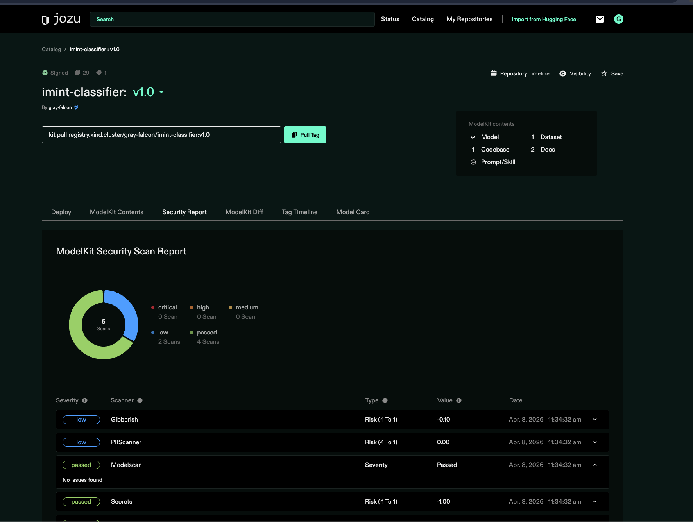

# TEM 26.2 — Demo Scenario

## The Threat Story

This is the single narrative thread running through the demo. You don't tell it linearly — drop pieces into each scene as context. But have the full story in your head.

### The Setup

A joint task force is planning a sensitive operation in a denied environment. The intelligence team relies on an imagery classification model to process drone and satellite feeds — identifying vehicles, personnel, and equipment at a series of locations. The model was originally sourced from a well-known open repository, fine-tuned internally, and has been running reliably for months.

A routine model update is needed. A team member pulls what appears to be the latest fine-tuned version from an internal share. The file name is right. The size looks right. The README matches. But the weights have been modified.

### The Threat

An adversary with access to the internal network (insider, compromised credentials, or supply chain infiltration of a partner) has replaced the model weights file with a version containing a serialization payload. When the model is loaded by the serving framework, the payload executes — establishing a reverse shell, exfiltrating the network topology, or silently modifying classification outputs so that certain vehicle types are systematically misidentified.

This isn't theoretical. Serialization attacks in model files (particularly Python pickle-based formats) are a documented threat vector. The model file looks identical to the legitimate version. Standard file integrity checks (file size, file type) don't catch it. Container scanning doesn't catch it — the model isn't a container. Antivirus doesn't catch it — it's not a known malware signature.

### What Happens Without Jozu

The model loads. The serving framework deserializes the weights. The payload executes. Depending on the attacker's objective:

1. **Exfiltration:** Reverse shell phones home. Network layout, connected systems, and operational data are exposed. In a tactical environment, this reveals force positions or operational timelines.
2. **Silent manipulation:** Classification outputs are subtly altered. Vehicles are misidentified. Targeting data is degraded. The team trusts the model because it worked yesterday — they have no reason to suspect it today.
3. **Denial:** The payload corrupts the runtime environment. The model crashes or produces garbage. In a DDIL environment with no easy replacement, the team loses an intelligence capability at a critical moment.

None of these are detected at runtime by observability tools. The model is "behaving" — producing outputs, responding to inputs, showing normal latency. The compromise is in the artifact itself, not in its runtime behavior.

### What Happens With Jozu

The updated model is pushed to Jozu Hub. Multiple scanners evaluate it:

- **ModelScan** detects the serialization payload in the weights file. Flagged immediately.
- A signed attestation recording the scan failure is attached to the artifact.
- **ArtifactPolicy** evaluates against the task force's requirements: clean scan results, valid cryptographic signature from the approved fine-tuning pipeline, provenance chain back to the original base model.
- The artifact fails on all three counts. It is **never made available for pull**.

When a team member at the edge attempts to pull the model into Agent Guard, the pull is denied. The audit log records who attempted the pull, which policy denied it, and why. The legitimate model — the one that passed scanning and carries valid signatures — remains in production.

### If Someone Asks "Has This Actually Happened?"

Serialization attacks in model files are well-documented in security research (Protect AI, MITRE ATLAS, Trail of Bits have all published on this). The attack vector is real. Public incidents attributed specifically to this vector in military contexts are not disclosed, but the threat modeling is consistent with published nation-state TTPs for supply chain compromise. Don't overclaim. The scenario is realistic and representative, not a case study.

---

---

## Before They Walk Up

Have the Jozu Hub dashboard open showing the artifact registry with several ModelKits already loaded — a mix of models, an MCP server, and agent configurations. Visual density makes it feel like a real operational environment, not a blank demo instance.

**Screen state:** Hub registry view, multiple ModelKits visible with scan status badges (green checks, one amber warning).

---

## THE HOOK (30–60 seconds)

> *Wait for them to approach or make eye contact. Don't launch into a pitch.*

**Say something like:**

> "Let me ask you a question. If someone on your team downloads a model from HuggingFace or installs an MCP server from GitHub — do you know what's actually in that artifact before it runs? Not what the README says is in it. What's *actually* in it."

*Pause. Let them answer or react.*

> "That's the problem we solve. Jozu verifies every AI artifact — models, agents, MCP servers — before they're allowed to execute. If something's been tampered with, backdoored, or just doesn't meet your policy, it never runs. And all of this works in completely disconnected environments."

**Transition:** "Let me show you what that looks like."

---

## ACT 1: SUPPLY CHAIN VERIFICATION (~5 minutes)

This is the core of the demo. Take your time here. This is where you're differentiated from everyone else at the event.

### Scene 1A: Packaging an AI Artifact (60–90 seconds)

**Action:** Show a Kitfile for a mission-relevant imagery classification model.

> "Everything starts with packaging. We use an open standard called ModelPack — it's a CNCF specification our CTO wrote. A model, its configuration, datasets, and metadata all get bundled into a single immutable OCI artifact called a ModelKit."

**Show on screen — the Kitfile:**

```yaml
manifestVersion: 1.0.0
package:
  name: gray-falcon-imint-classifier
  version: 1.0.0
  description: Imagery classification model for vehicle/personnel/equipment identification
  authors: ["GRAY FALCON Intel Cell"]
model:
  name: imint-classifier-v3
  path: ./model/classifier-v3.safetensors
  framework: pytorch
  license: internal-use-only
datasets:
  - name: training-validation
    path: ./data/validation-set/
    description: Validation dataset for classification accuracy baseline
code:
  - path: ./src/
    description: Inference pipeline and preprocessing
config:
  - path: ./config/inference.yaml
    description: Inference pipeline configuration
  - path: ./config/mcp-servers.yaml
    description: MCP server definitions (geospatial, report-retrieval, personnel-db)
```

**Run:**

```bash
kit pack . -t registry.kind.cluster/gray-falcon/imint-classifier:v1.0
```

> "kit pack creates an OCI-compliant ModelKit. Same OCI format your container images use. Same registries, same infrastructure. Nothing new to deploy."

**Then sign and push:**

```bash
cosign sign --key cosign.key registry.kind.cluster/gray-falcon/imint-classifier:v1.0
kit push registry.kind.cluster/gray-falcon/imint-classifier:v1.0
```

> "Cosign attaches a cryptographic signature. This proves who approved this artifact and that it hasn't been modified since signing. The signature travels with the artifact — it's not stored in a separate system that might be unreachable."

**If they ask about OCI/CNCF:** "OCI is the Open Container Initiative — the standard behind every container registry. ModelPack is the AI-specific extension of that standard, now in the CNCF alongside Kubernetes and Prometheus. We wrote the spec and donated it."

### Scene 1B: Security Scanning and Attestations (60–90 seconds)

**Action:** Show the scan results in Hub for the ModelKit you just pushed.

> "The moment an artifact lands in Hub, multiple independent scanners evaluate it — serialization attacks, data poisoning, adversarial susceptibility, prompt injection vectors, and PII exposure. Each scan result becomes a signed attestation attached directly to the artifact."

**Show on screen:**

- Hub scan results dashboard for the ModelKit
- Click into ModelScan results (serialization attack detection)
- Show the signed attestation attached to the artifact



> "These aren't just dashboard entries. They're cryptographically signed statements of fact, attached to the artifact itself. The attestation travels with the artifact. In a disconnected environment, you can verify the scan results locally without calling home."

**Key line (deliver with emphasis):**

> "Most AI governance starts at runtime — monitoring how a model is *behaving*. We verify the artifact *before it's allowed to behave at all*."

### Scene 1C: Policy Gate — The Artifact That Doesn't Pass (90–120 seconds)

**This is the money scene. This is what they'll remember.**

**Setup narration (weave in the threat story):**

> "Now let me show you what happens when something's wrong. Remember our scenario — a routine model update, same filename, same size, same README. But the weights have been replaced with a version carrying a serialization payload. Watch what happens when someone tries to deploy it."

**Show on screen — the ArtifactPolicy:**

```yaml
apiVersion: gerty.jozu.dev/v1
kind: ArtifactPolicy
metadata:
  name: gray-falcon-admission
spec:
  match:
    repositories:
      - "gray-falcon/*"
    artifactTypes:
      - "application/vnd.kitops.modelkit.config.v1+json"
    expression: 'request.action == "pull" && request.user.id != "jozu-admin@jozu.com"'
  action: Enforce
  rules:
    - name: require-scan-attestation
      assert: >-
        has(artifact.attestations)
        && artifact.attestations.exists(a, a.predicateType == 'https://kitops.org/attestation/scan/v1')
      message: "Artifact must have a scan attestation"

    - name: require-clean-modelscan
      assert: >-
        !artifact.attestations.exists(a,
          a.predicateType == 'https://kitops.org/attestation/scan/v1'
          && a.predicate.evaluations.exists(e,
               e.tool.name == 'modelscan'
               && e.metadata.total_issues_by_severity.CRITICAL > 0))
      message: "Artifact must not have critical ModelScan findings"
```

> "This is an ArtifactPolicy. Written in CEL — same expression language used in Kubernetes admission control. It says: nothing pulls without attestations and clean scan results. These aren't guidelines. They're gates."

**Action:** Show the pre-staged tampered ModelKit with amber/red scan status. Attempt to pull it:

```bash
kit pull registry.kind.cluster/gray-falcon/imint-classifier-compromised:v1.1 --tls-verify=false
```

**Show:** Pull DENIED. The policy gate prevents the artifact from being pulled — unsigned, critical scan finding (serialization payload), no valid provenance.

> "The policy required clean scan results and a valid signature from the approved training pipeline. This artifact has neither. It never loads. It never executes. The team at the edge never sees it. They keep running the verified model."

**Connect to mission:**

> "In your world, this means a compromised model — whether it's a supply chain attack, an insider threat, or just a bad download — gets caught at the registry. Not after it's running in a mission environment. Not after it's produced bad intelligence. Before it ever starts."

**If they push on attack types:** "Serialization attacks are the big one — a model file that executes arbitrary code when loaded. Data poisoning is the other — weights subtly modified to produce biased or incorrect outputs. Both look like normal model files to anything that isn't scanning for them specifically."

### Scene 1D: Artifact Diffing (30 seconds, optional — use if engaged)

> "Hub also does artifact diffing — side-by-side comparison of ModelKit versions. If someone updates a model, you can see exactly what changed in the weights, config, and dependencies before promoting it. Same concept as code review, applied to AI artifacts."

**Show:** Quick diff view in Hub between two versions.

---

## ACT 2: RUNTIME ENFORCEMENT (~3–4 minutes)

Transition cleanly. This should feel like "and there's more," not "now for a different product."

> "So that's supply chain — verifying artifacts before they run. But once an artifact passes and an agent is operating, you still need to control what it can do. That's Agent Guard — our secure runtime for AI agents."

### Scene 2A: Agent Definition & Agent Guard Launch (60–90 seconds)

**Show the Agent Definition on screen:**

```yaml
apiVersion: agentguard.jozu.dev/v1
kind: AgentDefinition
metadata:
  name: gray-falcon-imint-agent
spec:
  # No spec.framework — the coding agent is chosen at launch time
  # (agentguard run <agent>), so the same definition runs under
  # claude-code, codex, or gemini.
  modules:
    - name: geospatial-lookup
      type: mcp
      source:
        modelkit: registry.kind.cluster/gray-falcon/mcps/geospatial:v1

    - name: report-retrieval
      type: mcp
      source:
        modelkit: registry.kind.cluster/gray-falcon/mcps/reports:v1

    - name: tool-restrictions
      type: policy
      source:
        modelkit: registry.kind.cluster/gray-falcon/tool-control-policy:v1
```

> "This is an Agent Definition. It declares what the agent runs with: which MCP tool servers and which policies to enforce. It's packaged as a ModelKit — same OCI artifact, same registry, same supply chain controls we just showed you. Notice it doesn't pin a specific coding agent — the same signed definition can run under Claude Code, Codex, or Gemini. You choose the agent at launch."

> *Demo note: the agent is selected with the `AGENT` env var (default `claude-code`) before running the setup and scene scripts — `AGENT=codex`, `AGENT=gemini`. The commands below show `claude-code`.*

**Action — launch the signed agent with signature verification:**

```bash
agentguard run claude-code --agent-ref registry.kind.cluster/gray-falcon/imint-agent:v1 --pub-key cosign.pub -w /workspace
```

**Show the startup log — signature verification and artifact admission happen before the VM boots:**

```text
Verifying signature for registry.kind.cluster/gray-falcon/imint-agent:v1...
✓ Signature verified
Resolving agent definition: gray-falcon-imint-agent
✓ registry.kind.cluster/gray-falcon/tool-control-policy:v1 — trusted
Starting micro-VM...
Policy loaded: tool-restrictions
Agent ready
```

> "The `--pub-key` flag tells Agent Guard to verify the cosign signature on the agent definition before loading it. If the signature doesn't match — if someone tampered with the definition, replaced it, or it was never signed by the approved pipeline — it never loads."

**Show what happens with an UNSIGNED agent definition:**

```bash
agentguard run claude-code --agent-ref registry.kind.cluster/gray-falcon/imint-agent-unsigned:v1 --pub-key cosign.pub -w /workspace
```

```text
Verifying signature for registry.kind.cluster/gray-falcon/imint-agent-unsigned:v1...
✗ Signature verification failed
Agent blocked — signature verification failed
```

> "Same agent definition, same registry, same content — but unsigned. Agent Guard won't load it. In your environment, this means only agent definitions signed by your approved pipeline can run. A developer can't push an unauthorized agent definition and expect it to execute."

**Show what happens with an untrusted module reference:**

Show the untrusted agent definition — it references `ghcr.io/random-org/untrusted-tool:latest`:

```bash
agentguard run claude-code --agent-ref registry.kind.cluster/gray-falcon/imint-agent-untrusted:v1 --pub-key cosign.pub -w /workspace
```

```text
Verifying signature for registry.kind.cluster/gray-falcon/imint-agent-untrusted:v1...
✓ Signature verified
Resolving agent definition: gray-falcon-imint-agent-untrusted
✓ registry.kind.cluster/gray-falcon/tool-control-policy:v1 — trusted
! ghcr.io/random-org/untrusted-tool:latest — blocked
  Only registry.kind.cluster artifacts are trusted. Untrusted registry detected.
Agent blocked — untrusted module references detected
```

> "This one is signed — it passes signature verification. But the artifact admission policy catches the untrusted MCP reference. The agent never starts. The untrusted artifact never downloads. Two layers of verification: is the definition authentic, and are all its dependencies trusted."

### Scene 2B: Tool-Level Access Control (90–120 seconds)

**This is the runtime enforcement demo.**

**Show the ToolPolicy on screen:**

```yaml
apiVersion: gerty.jozu.dev/v1
kind: ToolPolicy
metadata:
  name: gray-falcon-tool-control
spec:
  match:
    tool:
      names:
        - "Bash"
  action: Enforce
  rules:
    - name: block-untrusted-installs
      assert: >-
        !(tool.arguments.command.contains("pip install")
        || tool.arguments.command.contains("npm install")
        || tool.arguments.command.contains("apt install")
        || tool.arguments.command.contains("apt-get install"))
      message: "Package installation from external sources is not allowed in this environment"
```

> "Every tool call the agent makes goes through the policy engine. This policy blocks any attempt to install packages from external sources — pip, npm, apt. In a denied environment, you don't want an agent pulling untrusted code from the internet. The policy is written in CEL, evaluated locally, and enforced at the OS level. Not via prompts. The agent physically cannot bypass this."

**Run scenarios live — show the policy log output from Agent Guard:**

**Scenario A — Allowed call:**
Agent reads a file in the workspace. Call succeeds.

```text
[policy] ALLOW  tool=Read    file_path=/workspace/data/report.json
```

> "File read, within policy. Allowed. Logged."

**Scenario B — Blocked call:**
Agent attempts to install a package. Immediate denial.

```text
[policy] BLOCK  tool=Bash    command="pip install requests"
         rule=block-untrusted-installs  message="Package installation from external sources is not allowed in this environment"
```

> "The agent tried to pull a package from the internet. Denied. In a disconnected environment, every dependency should already be in the approved artifact. The agent doesn't get to introduce new code from external sources. Fail closed."

### Scene 2C: DDIL Resilience (30–60 seconds)

State this as architectural fact. Don't attempt a live network kill at a booth — it's hard to show "no network" compellingly in that setting and fumbling the transition costs credibility.

> "Everything I just showed you — the policy enforcement, the tool access control, the audit logging — works with zero connectivity to Hub. The agent definition and all its modules are OCI artifacts, pulled and verified locally. Policies are pulled from the registry, cached, and auto-synced. The policy engine evaluates with no phone-home. The micro-VM is the ultimate air gap — nothing gets in or out that the policy doesn't allow."
> "Agent Guard supports both micro-VM isolation for maximum containment, and OS-level kernel sandboxing for lighter deployments. Either way, enforcement is below the application layer — the agent can't bypass it even if it tries."

**If they specifically ask you to prove disconnected operation,** and you're in a setting where you can do it cleanly (e.g., a private extended demo), use this:

```bash
# Kill connectivity to Hub
sudo route del -host hub.kind.cluster

# Re-run the tool call scenarios — all still enforce
# Show audit entries accumulating locally with connectivity: disconnected

# Restore
sudo route add -host hub.kind.cluster gw $GATEWAY_IP
# Agent Guard auto-syncs buffered entries to Hub
```

---

## THE CLOSE (30–60 seconds)

Don't oversell. Land the plane.

> "So to recap: Jozu verifies every AI artifact before it executes — models, agents, MCP servers. Signed, scanned, policy-gated. At runtime, we enforce tool-level access control on agents with default deny. Everything is auditable with cryptographic proof. And the whole thing works disconnected."

**The leave-behind question:**

> "Here's the question I'd encourage you to ask every other AI vendor you talk to here: *Can you verify that what's running in production is the artifact that was approved?* If the answer is no, they're starting governance after the most important decision has already been made."

**The threat story callback:**

> "The adversary in our scenario was counting on one thing: that nobody would look inside the model file before running it. That's the gap Jozu closes."

**Offer next steps naturally:**

> "Happy to go deeper on any of this — the scanning pipeline, policy authoring, edge deployment architecture, whatever's most relevant to what you're working on."

---

## OBJECTION HANDLING

### "Can this run at the edge / on a device?"

> "Yes. Agent Guard runs on servers, desktops, edge devices, and IoT. macOS and Linux today, Windows on the roadmap. Policies enforce locally with no connectivity dependency. That's the core architecture — central governance in Hub, local enforcement in Agent Guard."

### "What's your ATO / accreditation status?"

> "Tradewinds Awardable through CDAO as of February 2026. Platform One application is in process, response expected April 2026. FedRAMP 20x is in progress. The architecture is IL5/IL6 compatible — fully customer-hosted, no data leaves the environment. We don't hold clearances currently but leads can obtain them."

### "What about cATO?"

> "The tamper-evident audit trail maps directly to NIST SP 800-53 AU controls — AU-2, AU-3, AU-9, AU-10, AU-12. The supply chain scanning and signing maps to SR-3, SR-4, SR-9, SR-11. We can generate those mappings as compliance artifacts. The audit chain is specifically designed to survive IG scrutiny."

### "What about guardrails — content safety, PII, prompt injection?"

> "Content-layer guardrails are on our roadmap — Agent Guard has an integrated AI gateway (Bifrost) that gives us visibility into prompt and completion content, and the architecture is designed for policy-driven guardrail evaluation. But I'd frame it this way: guardrails are the last line of defense. Supply chain verification is the first. If you catch a backdoored model before it ever loads, you've eliminated an entire class of problems that guardrails would have to deal with after the fact. And tool-level access control — which we ship today — prevents unauthorized actions regardless of what the model outputs."

### "What if I need to update policies in a disconnected environment?"

> "Policies are OCI artifacts. You can distribute updated policies through any mechanism that can move a file — USB, sneakernet, tactical data link. When the artifact arrives, Agent Guard verifies the signature before loading it. You don't need Hub connectivity to accept a policy update. You need a signed artifact."

### "How does this work with our existing container infrastructure?"

> "ModelKits are OCI artifacts. They work with any OCI-compliant registry. Hub runs on standard Kubernetes. If you're already running containers, this fits into your existing infrastructure without a new stack."

### "Is this open source?"

> "The packaging layer is — KitOps is a CNCF Sandbox project, and ModelPack is a CNCF specification. Openly governed. Hub and Agent Guard are commercial products built on top of that open foundation. Think git/GitLab."

### "What's the cost / licensing model?"

Defer to Brad. If pressed: "Our licensing is designed for government procurement structures. Happy to connect you with our CEO to discuss specifics for your program."

### "Does Agent Guard work on Windows?"

> "Today it runs on macOS and Linux. Windows support via Hyper-V is in active development. For server and Kubernetes deployments, production-ready on Linux."

---

## TIMING GUIDE

| Section | Target Time | Running Total |
|---------|-------------|---------------|
| Hook | 0:30–1:00 | ~1:00 |
| Scene 1A: Packaging + Signing | 1:00–1:30 | ~2:30 |
| Scene 1B: Scanning + Attestations | 1:00–1:30 | ~4:00 |
| Scene 1C: Policy block (money scene) | 1:30–2:00 | ~6:00 |
| Scene 1D: Diffing (optional) | 0:30 | ~6:30 |
| Scene 2A: Agent Guard load | 0:30 | ~7:00 |
| Scene 2B: Tool access control (3 scenarios) | 1:30–2:00 | ~9:00 |
| Scene 2C: DDIL resilience | 0:30–1:00 | ~10:00 |
| Close | 0:30–1:00 | ~11:00 |

**If you're losing them:** Skip 1D, 2A. Go: Hook → 1B (scanning) → 1C (policy block) → 2B (tool control, Scenario B only) → Close. That's a tight 6-minute demo.

**If they're deeply engaged:** Expand 1C with more scan detail. Add 1D. Let 2B breathe with all three scenarios. Expand DDIL with the live network kill. Stretch to 12–15 minutes.

---

## DEMO ENVIRONMENT CHECKLIST

### Pre-Demo Setup

- [ ] Jozu Hub running on local Kind cluster at `https://hub.kind.cluster`
- [ ] Agent Guard running on macOS demo laptop, connected to Hub
- [ ] 3–4 ModelKits pre-loaded in Hub registry (mix of clean and flagged)
- [ ] At least one ModelKit with a real scan failure (serialization finding from ModelScan)
- [ ] ArtifactPolicy configured and active (the `gray-falcon-admission` policy from Scene 1C)
- [ ] ToolPolicy configured with deny, allow, and HIL rules (the `gray-falcon-tool-control` policy from Scene 2B)
- [ ] Agent Guard running with a live agent and three mock MCP tools (geospatial, report-retrieval, personnel-db)
- [ ] Cosign key pair generated (`cosign generate-key-pair`)
- [ ] Kitfile and policy YAML files open in editor for quick reference
- [ ] Audit log accessible and showing recent entries
- [ ] No dependency on external network for core demo flow
- [ ] DDIL toggle script ready (if doing extended demo with live network kill)
- [ ] Backup: screenshots/recordings of each key moment in case of hardware failure

### Key Commands Reference

```bash
# Package
kit pack . -t registry.kind.cluster/gray-falcon/imint-classifier:v1.0

# Sign
cosign sign --key cosign.key registry.kind.cluster/gray-falcon/imint-classifier:v1.0

# Push
kit push registry.kind.cluster/gray-falcon/imint-classifier:v1.0

# Run in Agent Guard
agentguard run registry.kind.cluster/gray-falcon/imint-classifier:v1.0

# Pull attempt (for the denied artifact)
agentguard pull registry.kind.cluster/gray-falcon/imint-classifier-compromised:v1.1

# Audit log
agentguard audit log --format json | tail -20

# DDIL toggle (extended demo only)
sudo route del -host hub.kind.cluster          # disconnect
sudo route add -host hub.kind.cluster gw $GW   # reconnect
```

### Hub Helm Install (One-Time Pre-Event)

```bash
helm install jozu-hub jozu/hub \
  --namespace jozu \
  --set global.domain=kind.cluster \
  --set persistence.enabled=true
```

---

## WHAT NOT TO DEMO

- **Don't demo or claim GuardrailPolicy.** Not yet implemented. If asked about content-layer guardrails (PII, prompt injection, toxicity), frame as roadmap with Bifrost architecture already in place. Redirect to supply chain verification and ToolPolicy as the capabilities you ship today.
- **Don't demo Hub's HuggingFace import or model diffing** (unless asked — Scene 1D is the exception). Interesting features, not differentiators for this audience.
- **Don't demo RICs.** Complex to explain in limited time, not the primary value prop for SOCOM.
- **Don't show the MCP Registry API IDE integration.** Developer-facing feature, wrong audience.
- **Don't claim FedRAMP authorization.** Say "FedRAMP 20x in progress." This audience detects overstatement permanently.
- **Don't claim paying customers.** Lead with technical architecture and differentiation, not installed base.
- **Don't say "certified" or "compliant."** Say "supports" or "enables compliance with."
- **Don't use "cloud-native" or "cloud-based."** This audience reads that as "requires connectivity."
